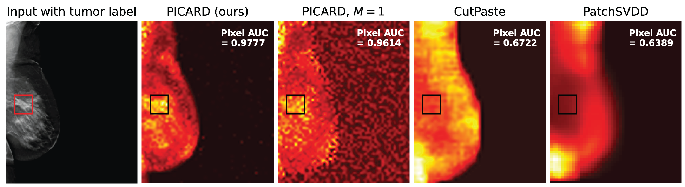

# Pluralistic Image Completion for Anomaly Detection (Med. Image Anal. 2023)

#### By [Nicholas Konz](https://nickk124.github.io/), Haoyu Dong and [Maciej Mazurowski](https://sites.duke.edu/mazurowski/).

[](https://arxiv.org/abs/2305.03098)


This is the official repository for our image anomaly detection model **PICARD** (**P**luralistic **I**mage **C**ompletion for **A**nomalous **R**epresentation **D**etection) from our paper [*Unsupervised anomaly localization in high-resolution breast scans using deep pluralistic image completion*](https://arxiv.org/abs/2305.03098) (in Medical Image Analysis 2023). PICARD uses deep learning and pluralistic image completion to localize anomalies in images, while only being trained on images **without** anomalies. This works by comparing different non-anomalous completions of a masked image region to the actual (possibly anomalous) appearance of the region (see the full [abstract and novel contributions list below](#abstract-and-contributions)).

**In this repository we provide easy-to-use code and step-by-step instructions to train and test PICARD on your own data.**

PICARD achieves **state-of-the-art performance** on a challenging tumor detection task in high-resolution digital breast tomosynthesis (one example shown below). Moreover, our method is **significantly faster than other approaches**, due to our novel application of channel-wise dropout to the image completion network during inference, allowing for the rapid sampling of different completions for an image region.



The basic diagram of our model is shown under the [Model Diagram](#model-diagram) section of this README.

## Citation

Please cite our paper if you use our code or reference our work (published version citation forthcoming):
```bib
@article{konz2023picard,
  title={Unsupervised anomaly localization in high-resolution breast scans using deep pluralistic image completion},
  author={Konz, Nicholas and Dong, Haoyu and Mazurowski, Maciej A},
  journal={arXiv preprint arXiv:2305.03098},
  year={2023}
}
```

## Code Usage/Installation

You can use our model to predict anomaly heatmaps in new images, given a training set of only normal images. Follow the steps below to see how to train and test PICARD on your own data.

### Step 0: Requirements

You'll need to have Python 3 installed. You can install the required packages with:

```bash
pip3 install torch==1.8.1+cu111 torchvision==0.9.1+cu111 torchaudio==0.8.1 -f https://download.pytorch.org/whl/torch_stable.html
pip3 install -r requirements.txt
```

### Step 1: Model Training

First, you'll need to train the pluralistic image completion network/inpainter on your training data of normal/non-anomalous images, via the following steps.

1. Edit `configs/default.yaml` to set your `dataset_name`, and set `train_data_path` to be the folder that contains your training set of normal (non-anomalous) images, **relative to the `inpainter` directory**.

This config file contains many other settings you may adjust, including GPU IDs.

Our model is designed to detect anomalies in high-resolution images (our original breast tomosynthesis dataset has images around `2000x2500`), so by default, the inpainter completes `128x128` square regions centered at `256x256` patches of a full-size image. These settings can be modified with `train:image_shape` and `train:mask_shape` in `configs/default.yaml`, respectively.

2. **If your images are RGB/3-channel**, set `train:image_shape[2] = 3` in `configs/default.yaml` (default is `1`, for grayscale images).

3. Run the following to train the inpainter:

```bash
cd inpainter
python3 train.py --config ../configs/default.yaml
```

The checkpoints for the inpainter/generator and the discriminator/critic will update in `inpainter/checkpoints/` as training progresses, in the form of `**/gen_{iteration}.pt` and `**/dis_{iteration}.pt`, respectively. You can control the frequency at which checkpoints save with `train:snapshot_save_iter` in the config file, and can also monitor the training progress with Tensorboard by running `tensorboard --logdir logs/`.


### Step 2: Model Testing / Anomaly Heatmap Generation

Now that you've trained the inpainter, you can use it to generate anomaly heatmaps for some normal or anomalous test images, by detecting anomalies on a dense overlapping grid of patches from each image in a parallelized sliding window fashion (see [Model Diagram](#model-diagram) for an illustration of this process).

To set up the testing environment, edit `configs/default.yaml` by:

1. setting `test_data_path` to be the folder that contains your test set of images, **relative to the base directory**, and
2. setting `test:patch_shape` and `test:mask_shape` to the values you used for `train:image_shape` and `train:mask_shape`, respectively.

There are many additional options for heatmap generation and visualization under `test` in the config file which you may also adjust, such as the heatmapping window stride, multi-completion and parallelized patch batch sizes, etc.

Now, run the following to predict anomaly heatmaps for the test set **from the base directory**:

```bash
python3 predict_heatmap.py --config configs/default.yaml --checkpoint_iter {CHECKPOINT ITERATION}  --checkpoint_dir {CHECKPOINT DIRECTORY} 
```

where `{CHECKPOINT ITERATION}` is the iteration of the inpainter checkpoint that you want to use, and `{CHECKPOINT DIRECTORY}` is the path to the directory containing the inpainter checkpoints `**/gen_{CHECKPOINT ITERATION}.pt` and `**/dis_{CHECKPOINT ITERATION}.pt`. We used the iteration where the average $L_1$ error between the inpaintings and the ground truths on the training set was the lowest.

If you don't have enough GPU memory, try reducing `test:parallel_batchsize` in the config, which is the number of image patches that completions are created for at once. Completed heatmaps will be saved in `heatmaps`, as both images and PyTorch tensors. We also provide heatmap scoring and statistical visualization tools in `eval.py`.

## Model Diagram

(From Figures 1 and 2 in the paper.)


## Abstract and Contributions

Automated tumor detection in Digital Breast Tomosynthesis (DBT) is a difficult task due to natural tumor rarity, breast tissue variability, and high resolution. Given the scarcity of abnormal images and the abundance of normal images for this problem, an anomaly detection/localization approach could be well-suited. However, most anomaly localization research in machine learning focuses on non-medical datasets, and we find that these methods fall short when adapted to medical imaging datasets. The problem is alleviated when we solve the task from the image completion perspective, in which the presence of anomalies can be indicated by a discrepancy between the original appearance and its auto-completion conditioned on the surroundings. However, there are often many valid normal completions given the same surroundings, especially in the DBT dataset, making this evaluation criterion less precise. To address such an issue, we consider *pluralistic image completion* by exploring the distribution of possible completions instead of generating fixed predictions. This is achieved through our novel application of spatial dropout on the completion network during inference time only, which requires no additional training cost and is effective at generating diverse completions. We further propose **minimum completion distance** (MCD), a new metric for detecting anomalies, thanks to these stochastic completions. We provide theoretical as well as empirical support for the superiority over existing methods of using the proposed method for anomaly localization. On the DBT dataset, our model outperforms other state-of-the-art methods by at least 10% AUROC for pixel-level detection.

### Our Novel Contributions

1. We introduce a novel anomaly localization model that uses channel-wise dropout on image patches to rapidly sample *pluralistic* completions of patches in order to localize anomalies on the image.
2. We propose a novel evaluation metric, MCD, for completion similarity assessment and anomaly scoring. We provide a thorough analysis of the effectiveness of this metric.
3. By adopting existing state-of-the-art methods that aim for natural / low-resolution images, we build an anomaly localization performance benchmark on the challenging DBT dataset, in which our method outperforms these methods by a large margin. This benchmark also serves as a foundation for future works.
